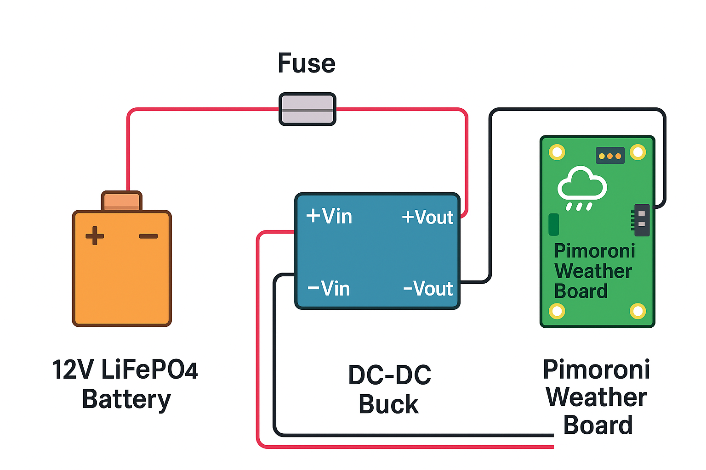

# weatherstation
Capture weather data and send to an mqtt broker
## 🔋 Off-Grid Power Setup for Pimoroni Weather Board

This schematic shows how to power a Pimoroni weather board from a 12V LiFePO4 battery housed inside a Stevensons container. The board wakes every 5 minutes, so the system includes a buck converter to drop voltage to 5V and a fuse for protection.

**Components:**
- 12V LiFePO4 battery (20Ah recommended for 3-month runtime)
- XT60 connector or Anderson Powerpole for modular swaps
- 3A blade fuse on the 12V line
- DC-DC buck converter (12V → 5V, rated ≥3A)
- 220µF electrolytic + 0.1µF ceramic capacitor on 5V output
- Pimoroni weather board (with deep sleep enabled)

**Installation Notes:**
- Mount all components inside a weatherproof box within the container
- Use strain relief and sealed connectors to prevent corrosion
- Add a voltmeter or low-voltage cutoff to protect the battery
- Optional: log current draw with INA219 or USB meter to refine runtime estimates

*Figure: Schematic showing battery, fuse, buck converter, and weather board wiring.*

## 🔄 Battery Swap Instructions

To maintain uninterrupted power for the Pimoroni weather board, swap the 12V LiFePO4 battery every 3 months (or as needed based on runtime measurements). This guide ensures safe, reproducible swaps inside the Stevensons container.

### 🧰 Required Items
- Fully charged 12V LiFePO4 battery (20Ah recommended)
- XT60 or Anderson Powerpole connectors
- 3A blade fuse (spare)
- Multimeter (optional, for voltage check)
- Insulated gloves (recommended)

### 🔌 Swap Procedure

1. **Prepare the replacement battery**
   - Confirm it's fully charged (≥13.2V for LiFePO4).
   - Inspect terminals and connectors for corrosion or damage.

2. **Power down the weather board**
   - If possible, wait for a sleep cycle or manually disable the board.
   - Disconnect the 5V line from the buck converter output.

3. **Disconnect the old battery**
   - Unplug the XT60 or Anderson connector.
   - Remove the fuse if inline.
   - Store the old battery in a safe, dry location for recharging.

4. **Install the new battery**
   - Connect the XT60 or Anderson plug securely.
   - Insert a fresh 3A fuse if needed.
   - Verify polarity: red to +Vin, black to –Vin on the buck converter.

5. **Restore power**
   - Reconnect the 5V line to the weather board.
   - Confirm LED or sensor activity during the next wake cycle.

6. **Log the swap**
   - Record the date, battery voltage, and any observations.
   - Update runtime estimates based on previous cycle duration.

### ⚠️ Safety Notes
- Never short the terminals or reverse polarity.
- Avoid swapping during rain or high humidity.
- Recharge removed batteries using a LiFePO4-compatible charger only.

*Figure: Battery swap ensures continuous operation with minimal downtime and traceable maintenance.*

## 🛒 Purchase List: Off-Grid Power Setup for Pimoroni Weather Board

This list includes all components needed to power a Pimoroni weather board from a 12V LiFePO4 battery inside a Stevensons container. Prices are approximate and based on UK availability as of November 2025.

### 🔋 Core Components

| Item | Description | Source | Price |
|------|-------------|--------|-------|
| **12V 20Ah LiFePO4 Battery (with BMS)** | Deep cycle lithium iron phosphate battery | [AliExpress](https://www.aliexpress.com/item/1005009622840796.html) | £43.79 |
| **12V 20Ah LiFePO4 Battery (UK stock)** | Faster delivery, UK warranty | [OnBuy](https://www.onbuy.com/gb/p/20ah-128v-256w-yes-lifepo4-battery-128v-lithium-ion-iron-phosphate-12v-deep-cycle-heavy-duty-caravan-camping-golf~p40965044/) | £89.99 |
| **XT60 Connectors (10-pack)** | Modular battery connectors | [Amazon UK](https://www.amazon.co.uk/Zsanhua-XT60-Connectors-Battery-Connector/dp/B0BTLP9Y82) | £5.49 |
| **3A Blade Fuse + Holder (5-pack)** | Inline protection for buck converter | [Amazon UK](https://www.amazon.co.uk/dp/B0FSYNHNDL) | £6.79 |
| **DC-DC Buck Converter (12V → 5V, 3A)** | Voltage regulator for Pimoroni board | [OnBuy](https://www.onbuy.com/gb/p/dc-dc-12v24v-to-5v-3a-buck-converter-step-down~p159474550/) | £23.71 |
| **220µF Electrolytic Capacitor** | Output smoothing | [Amazon UK](https://www.amazon.co.uk/s?k=220uf+capacitor) | ~£2.00 |
| **0.1µF Ceramic Capacitor** | High-frequency filtering | [Amazon UK](https://www.amazon.co.uk/s?k=0.1uf+ceramic+capacitor) | ~£1.50 |
| **Weatherproof Project Box** | Enclosure for components | [Amazon UK](https://www.amazon.co.uk/s?k=weatherproof+project+box) | £8–£15 |

### 🔌 Charging Equipment

| Item | Description | Source | Price |
|------|-------------|--------|-------|
| **14.6V 8A LiFePO4 Charger (UK)** | Smart charger with CC/CV profile | [OnBuy](https://www.onbuy.com/gb/p/146v-8a-lifepo4-battery-charger-for-life-po4-battery-pack-uk~p96024748/) | £72.80 |
| **14.6V 5A LiFePO4 Charger (compact)** | Slower but portable option | [OnBuy](https://www.onbuy.com/gb/p/146v-5a-lifepo4-charger-4series-12v-5a-lifepo4-battery-charger-144v-battery-smart-charger-for-4s-12v-lifepo4-battery-kr~p96026024/) | £84.50 |

### 🧰 Optional Tools

| Item | Description | Source | Price |
|------|-------------|--------|-------|
| **Multimeter or USB inline meter** | For voltage/current checks | [Amazon UK](https://www.amazon.co.uk/s?k=usb+inline+meter) | £10–£20 |
| **INA219 Current Sensor Module** | Logs current draw over time | [Amazon UK](https://www.amazon.co.uk/s?k=INA219+module) | £6–£12 |
| **Low-Voltage Cutoff Module** | Protects battery from over-discharge | [Amazon UK](https://www.amazon.co.uk/s?k=low+voltage+cutoff+module) | £8–£15 |

*Prices may vary slightly depending on seller and shipping. Always confirm compatibility and safety ratings before purchase.*
